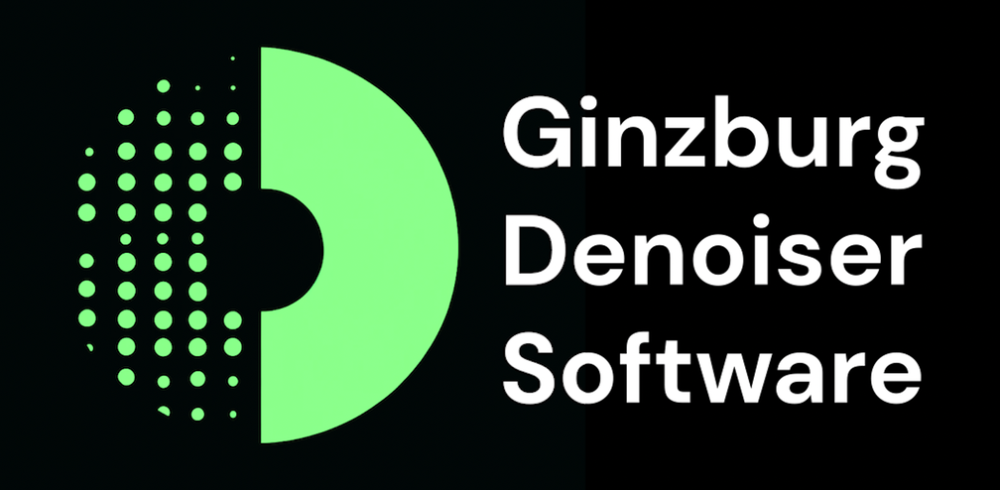
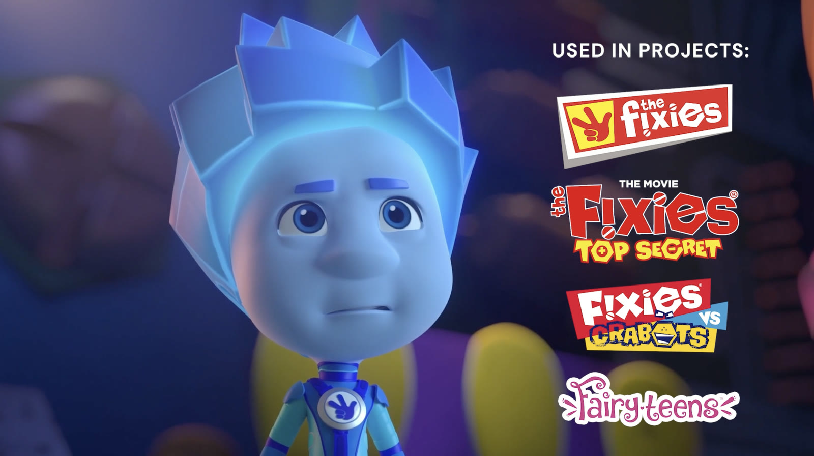
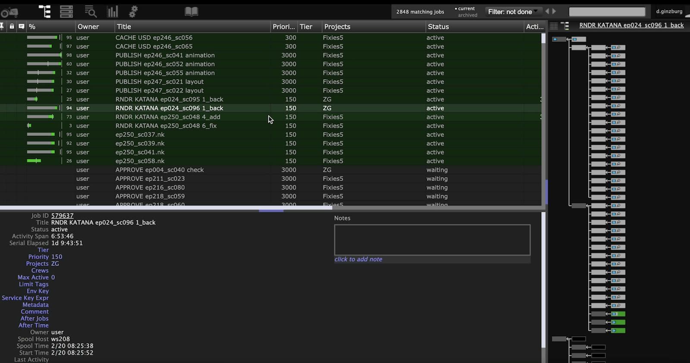
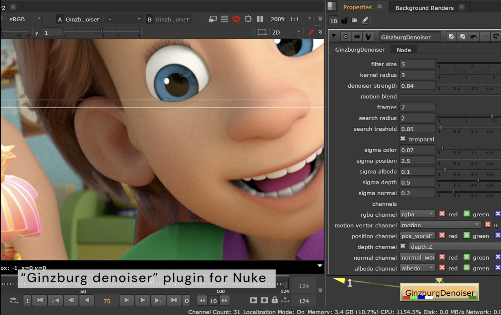
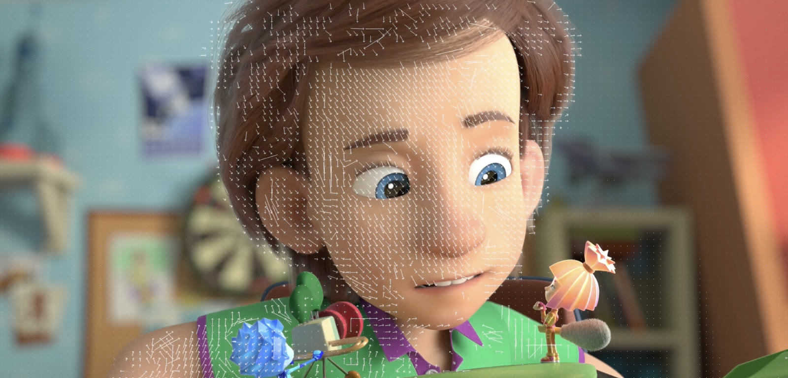
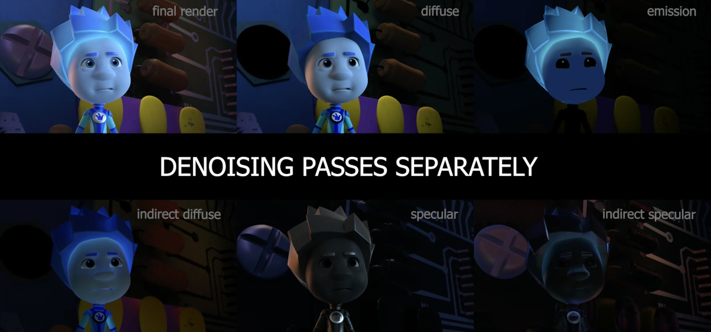
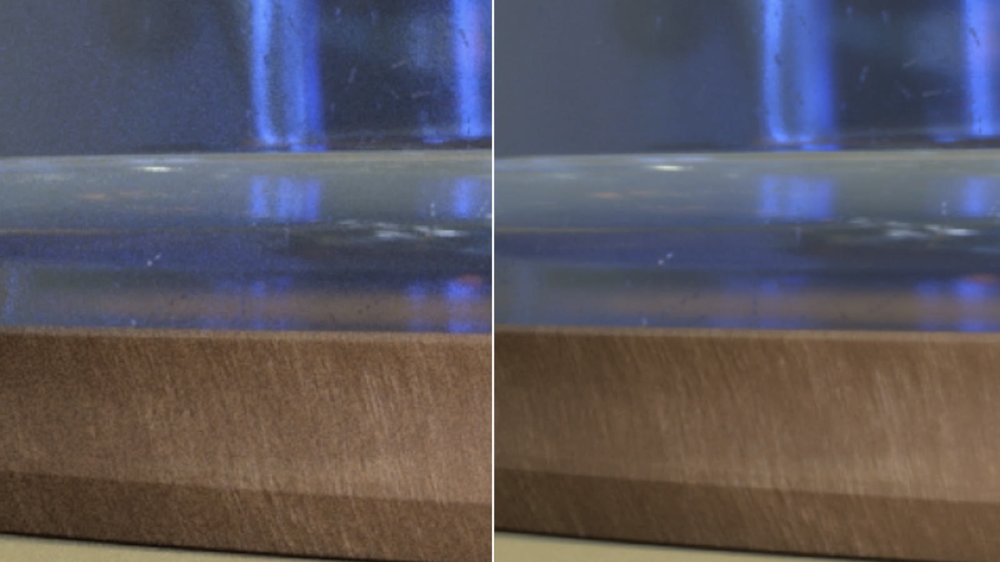
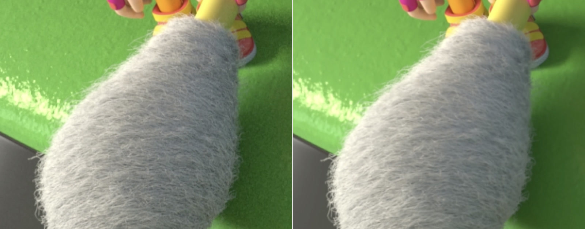
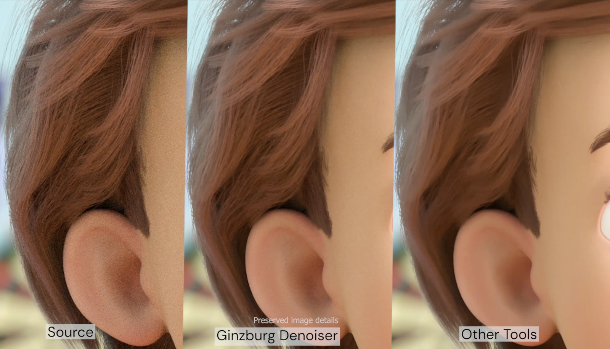

# Ginzburg Denoiser

**Deterministic production spatiotemporal denoising software for Monte Carlo path-traced animation and VFX renders.**



Developed from 2016 to 2020. Shipped for Linux and Windows as a standalone application and a Foundry Nuke plug-in, with a C++/Python API for Maya-RenderMan pipeline integration.

[Watch the project reel (1:35)](https://www.youtube.com/watch?v=dqq-chYzEYs)

## Overview

Path tracers estimate light transport using Monte Carlo sampling. At low samples per pixel (spp), estimator variance appears as stochastic noise in the rendered image. Increasing spp reduces the variance but raises render time and compute cost across every frame in a sequence.

<p align="center">
  <a href="https://www.youtube.com/watch?v=dqq-chYzEYs">
    
  </a>
</p>

Ginzburg Denoiser removes Monte Carlo noise from low-sample renders so fewer spp are required for a production-quality result. The system was designed to preserve hair, fur, bump, displacement and specular detail while maintaining temporal stability across animated sequences.

The original Ginzburg Denoiser is a classical, non-data-driven system. It does not use training data, neural networks or learned weights. Its output is controlled by explicit filtering algorithms, motion estimation, renderer AOVs and artist-defined parameters.

The denoiser combines hybrid Non-Local Means and median spatial filtering with motion-estimated temporal accumulation. In addition to the noisy colour image, it uses auxiliary render buffers for motion, world position, depth, surface normals and albedo. Renderers expose these buffers as Arbitrary Output Variables (AOVs).

The software was integrated into a Maya-RenderMan production pipeline and used directly by lighting artists in Nuke. It was deployed on *The Fixies*, *The Fixies: Top Secret*, *Fixies vs. Crabots* and *Fairy-teens*. In production, the system reduced noise by up to **7x** and lowered rendering budgets by approximately **30%**.

<p align="center">
  
</p>

## How it works

Ginzburg Denoiser processes the beauty buffer together with lighting passes and auxiliary AOVs. Spatial filter weights use colour and scene features to reject samples across geometric or material boundaries. The temporal stage aligns adjacent frames with motion vectors and adds valid history samples before filtering.

```text
Maya + RenderMan
  │
  ├── beauty / diffuse / specular passes
  └── motion / position / depth / normal / albedo AOVs
                         │
                         ▼
              motion estimation + temporal window
                         │
                         ▼
                hybrid NLM + median filtering
                         │
                         ▼
                 standalone app / Nuke plug-in
```

### Spatial filtering

Non-Local Means searches for image regions with similar structure instead of averaging every neighbouring pixel. The median stage removes isolated bright or dark noise pixels. The combination reduced noise without relying on a wide blur.

### Auxiliary AOVs

An AOV is an Arbitrary Output Variable: an additional image buffer exported by the renderer alongside the beauty image. The filter used the following AOVs together with RGB values:

| Channel | Purpose |
| --- | --- |
| `rgba` | Image component being denoised |
| `motion` | Alignment and search across adjacent frames |
| `pos_world` | Separation of surfaces in world space |
| `depth.Z` | Rejection across depth discontinuities |
| `normal_world` | Protection of surface orientation changes |
| `albedo` | Material boundaries without lighting noise |

Each guide had an independent sigma value. These values controlled how strongly differences in colour, geometry and material data affected the filter weights.

<p align="center">
  
</p>

### Temporal filtering

Motion vectors reprojected adjacent frames into the current frame. A local search corrected alignment errors. Temporal accumulation increased the effective sample count without increasing the spatial filter radius. Search thresholds rejected unreliable history samples and limited ghosting.

<p align="center">
  
</p>

### Per-pass denoising

Diffuse, indirect diffuse, emission, specular and indirect specular passes could be denoised independently and recombined afterwards. This allowed stronger filtering of high-variance specular components without applying the same parameters to the diffuse signal.

<p align="center">
  
</p>

## Comparison with beauty-only denoising

| Beauty-only denoiser | Ginzburg Denoiser |
| --- | --- |
| Uses one RGB frame | Uses RGB, motion, position, depth, normal and albedo |
| Reduces more noise by widening the filter | Adds motion-aligned samples from adjacent frames |
| Processes the combined beauty image | Processes lighting components independently |
| Uses one set of settings for the image | Exposes spatial, temporal, search and guide controls in Nuke |
| Can produce frame-to-frame instability | Includes motion-aware temporal filtering |

The additional scene data and temporal samples allowed stronger noise reduction without increasing spatial smoothing.

## Results

<p align="center">
  
</p>

<p align="center"><sub><strong>Left:</strong> noisy render - <strong>Right:</strong> Ginzburg Denoiser.</sub></p>

<p align="center">
  
</p>

<p align="center"><sub><strong>Left:</strong> noisy render - <strong>Right:</strong> denoised result. The fur structure remains visible after filtering.</sub></p>

<p align="center">
  
</p>

<p align="center"><sub><strong>Source - Ginzburg Denoiser - Other tools.</strong> The centre image retains more of the original hair structure.</sub></p>

## Project evolution

Ginzburg Denoiser grew out of my research on wavelet-temporal filtering for rendered sequences. I presented this work in the 2016 technical lecture *Wavelet-Temporal Hybrid Filtering for Noise Suppression in Rendered Sequences*. The research later became my first complete imaging product: a deterministic filtering method, cross-platform application, C++/Python API, Nuke integration and production deployment.

The next stage of the work is split across two projects:

- [Ginzburg Neural Denoiser](https://github.com/ginzburg-dev/ginzburg-neural-denoiser) is the data-driven ML evolution. It covers learned spatial denoising, motion-compensated temporal restoration and neural inference.
- [Denoise Machine X](https://github.com/ginzburg-dev/denoise-machine-x) is the modular C++ plugin system for classical and neural filters, image IO, CPU/CUDA execution and DCC pipeline integration.

## Project reel

### [Ginzburg Denoiser Software - Denoising Tool for CGI Animation and VFX](https://www.youtube.com/watch?v=dqq-chYzEYs)

Ginzburg.Productions · 1:35 · published April 2024

---

This repository documents the original Ginzburg Denoiser. Production source code, binaries and installation packages are not included.
